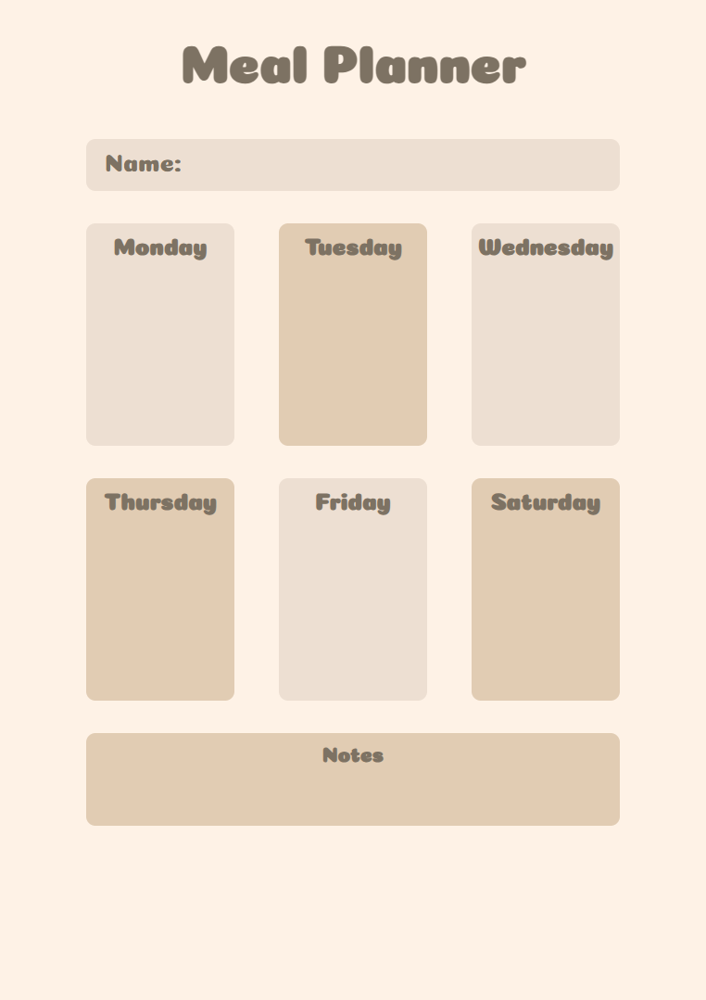

# MealPlanner

This simple project was made with the aim of practicing and improving skills with Angular 18 (no standalone)

## Description

The components developed in the project include card, input and notes. Each of them is dynamic, using property binding and CSS binding techniques to allow interaction and visual customization. The card component displays structured information, input handles user data input and notes organizes notes in a practical and visual way.

## Preview

